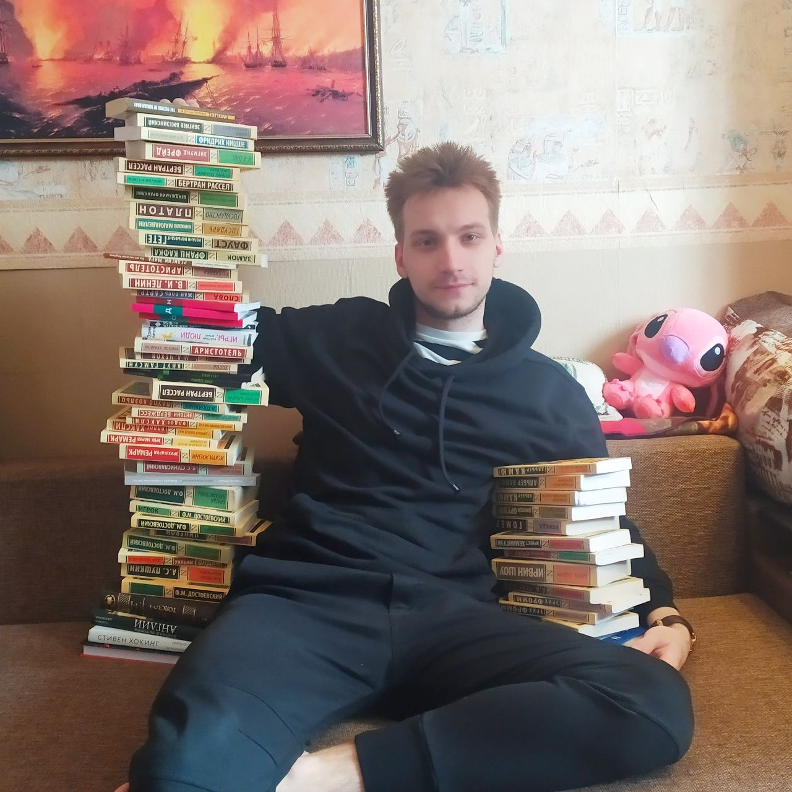

<h4 align="center">Marchenko Artem</h4>

    </img>
    

        <strong>Contacts:</strong> 
        Email: arte19981@gmail.com 
        Phone: +7-965-777-54-81 
        Telegram: @modzhickk 
        GitHub: VegaMethadon 
    

### DOB:

October 14, 1999; Russia, Saint-Petersburg

### Address:

Russia, Saint-Petersburg;
Marshala Zaharova; 198328

### Education:

- **2022 - 2025**: M.A. ITMO, Russia (Software Engineering)
- **2020 - 2021**: B.A. Sciences Po, France (Political Science)
- **2018 - 2022**: B.A. RANEPA, Russia (Political Science)

### Awards and Honors:
- Recipient of the Russian Presidential Grant for scientific accomplishments
- Silver medalist of the All-Russian 'I Am a Professional' Student Olympiad in Technological Entrepreneurship
- Finalist of the All-Russian 'I Am a Professional' Student Olympiad in Software Engineering
- Two-time Semifinalist of the All-Russian 'I Am a Professional' Student Olympiad in Business Informatics
- Finalist of the All-Russian "I Am a Professional" Student Olympiad in Green Energy
- Master's Degree with Honors

### Professional Experience:

**Huawei R&D** | Programming Language Lab (Sep. 2024 - present)
  Developing Cangjie programming language compiler.
  **Key achievements:**
  1. Test framework modification - added new test output features.
  2. Contributed to enhancing the @Derive macro that auto-generates interface implementations for classes, structs, and enums.  

**Labyrinth** | Application architecture design, technology stack selection, and backend development.
**Key achievements:**
1. Created comprehensive application architecture in UML notation using class, sequence, activity diagrams at project level.
2. Selected optimal technology stack and developed modular backend adhering to REST principles.
3. Implemented comprehensive test coverage.

**ITMO** | CPU-bound computations parallelization, Configured CI/CD pipelines in GitHub Actions, Developed NLP projects based on transformer architecture, Built full-stack applications

**Courses**
- Introduction to AI Tools and Methods | Open Education, Machine Learning
- Introduction to Algorithms | MIT, Algorithms and Data Structures
- Algorithms and Data Structures | VK Education, Algorithms and Data Structures

### Skills:
- **Programming Languages**: C, Go, Python (ML), Cangjie, Rust, TypeScript
- **Databases**: MongoDB, PostgreSQL, Redis, Minio
- **OS**: Linux, Win
- **Languages**: Russian(native), English(B2, 6.5 IETLS Academic), French(A2)
- **Others**: Git, Docker, UML, Swagger, REST, NATS

### Interests:
**Sports**: Trains discipline and focus
**Entrepreneurship**: Applying programming knowledge to solve real business problems